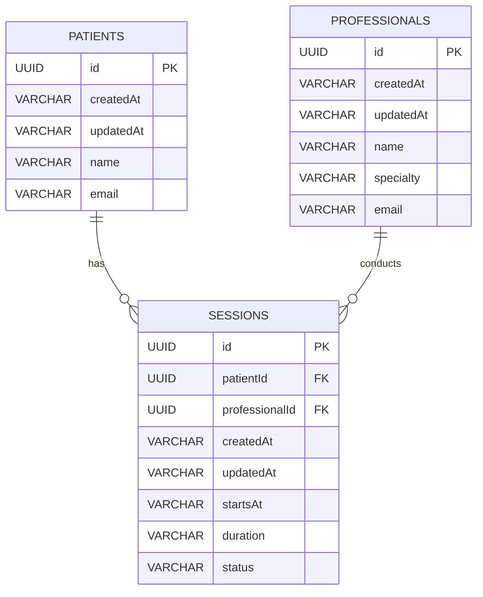

# MediTrack

MediTrack é um sistema de gerenciamento de sessões entre pacientes e profissionais de saúde.

## Descrição

Este projeto é uma aplicação Java Spring Boot para facilitar o agendamento e o acompanhamento de sessões entre pacientes e profissionais de saúde. Ele fornece uma interface para pacientes e profissionais gerenciarem suas sessões, visualizando informações como data, duração e status da sessão.

## Funcionalidades

- Cadastro e gerenciamento de pacientes
- Cadastro e gerenciamento de profissionais de saúde
- Agendamento de sessões entre profissionais e pacientes
- Acompanhamento do status das sessões
- Atualização de informações das sessões

## Tecnologias Utilizadas

- Java
- Spring Boot
- Spring Data JPA
- Banco de dados em memória (PostgreSQL futuramente)
- Maven

## Como Executar

1. Clone o repositório para sua máquina local.
2. Certifique-se de ter o Java instalado em sua máquina.
3. Configure as propriedades do banco de dados no arquivo `application.properties`.
4. Execute o projeto utilizando sua IDE de preferência.
5. Acesse a aplicação em `http://localhost:8080`.

# Diagramas de Relacionamento de Entidades

## Diagrama ERD de Pacientes, Profissionais e Sessões

