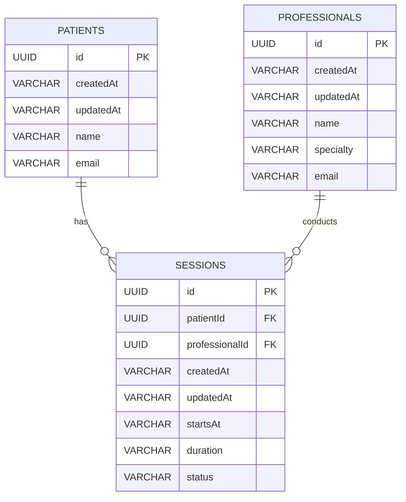

# Diagramas de Relacionamento de Entidades

## Diagrama ERD de Pacientes, Profissionais e Sessões

```mermaid
erDiagram
    PATIENTS {
        UUID id PK
        VARCHAR createdAt
        VARCHAR updatedAt
        VARCHAR name
        VARCHAR email
    }

    PROFESSIONALS {
        UUID id PK
        VARCHAR createdAt
        VARCHAR updatedAt
        VARCHAR name
        VARCHAR specialty
        VARCHAR email
    }

    SESSIONS {
        UUID id PK
        UUID patientId FK
        UUID professionalId FK
        VARCHAR createdAt
        VARCHAR updatedAt
        VARCHAR startsAt
        VARCHAR duration
        VARCHAR status
    }

    PATIENTS ||--o{ SESSIONS: "has"
    PROFESSIONALS ||--o{ SESSIONS: "conducts"
```
